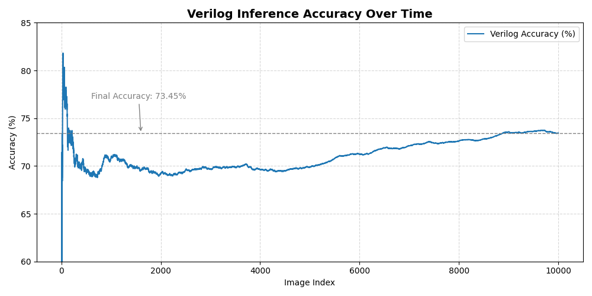
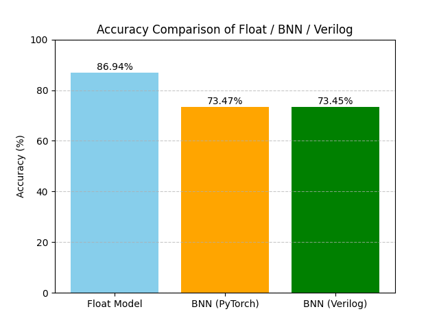
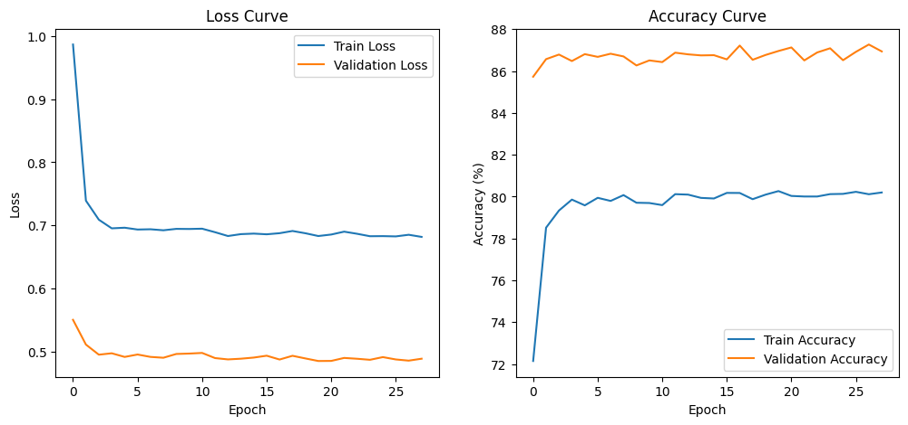

# 🧠 Binarized Neural Network on FPGA

This project demonstrates an FPGA-based implementation of a Binarized Neural Network (BNN), transplanting a PyTorch-trained BNN model into Verilog for real-time classification of MNIST handwritten digits

## 🎯 Purpose
Explore the feasibility of real-time handwritten digit classfication using BNNs on FPGA

## ✨ Highlight
- Train binarizd models in PyTorch and export them for Verilog deployment
- FC-layer-based inference pipeline: **XNOR + Popcount + Threshold**
- Threshold correction based on **BatchNorm statistics**
- Testbench simulation accuracy: **73.45%**

## Structure
1. **PyTorch** : BNN Training
2. **Export** of binary weights and thresholds (`.txt`)
3. **Verilog-based inference** pipeline: `FC1 → FC2 → Argmax`
4. **SystemVerilog Testbench** simulation

## 📂 File Description
| File                    | Description                                       |
| ----------------------- | ------------------------------------------------- |
| `BNN.py`                | PyTorch training script for BNN                   |
| `fc1_weight_bin.txt`    | Binary weights for FC1 layer                      |
| `fc1_threshold_bin.txt` | Thresholds for FC1 layer                          |
| `tb_BNN.v`              | SystemVerilog testbench                           |
| `accuracy_log.txt`      | Cumulative accuracy log from testbench simulation |

## 📊 Performance
- **PyTorch test accuracy** : 86.94%
- **Verilog simulation accuracy** : 73.45%
- **Dataset** : MNIST (Test set: 10000 samples)

## 📈 Result Graph

## 📜 License
MIT License

## Developed by.
**Jo Yonggi**
2nd-year Undergraduate
Department of Aviation Electronics and Information Engineering
Korea Aerospace University
GitHub: [@CourageHW](https://github.com/CourageHW)